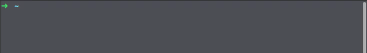

### O que eu preciso para rodar?

Primeiramente é necessário ter o nodejs instalado e um navegador web. A variação da interface é feita através de um dado enviado pela serial do computador do usuário. 

### Como Instalar o NodeJS? 

Vá até o [site do node](https://nodejs.org) e faça o download da versão LTS para o seu sistema operacional. Instale o arquivo baixado da forma como esá habituado a fazer com seu sistema.
Após o término da instalação execute no terminal os comandos "node -v" e "npm -v". A resposta dada pelo terminal deve ser algo como mostra a figura abaixo:

  

