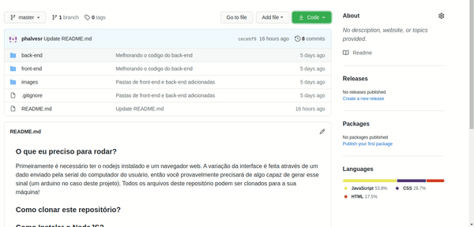
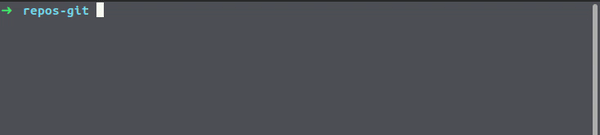

### O que eu preciso para rodar?

Primeiramente é necessário ter o nodejs instalado e um navegador web. A variação da interface é feita através de um dado enviado pela serial do computador do usuário, então você provavelmente precisará de algo capaz de gerar esse sinal (um arduino no caso deste projeto). Todos os arquivos deste repositório podem ser clonados para a sua máquina!

### Como clonar este repositório?

Exitem duas formas de clonar este repositório: baixando o git diretamente pelo navegador (não é necessário cadastro no github) e clonando o repositório através do bash de comandos do git (ou o equivalente a um terminal com acesso ao git na sua náquina).

- **Fazendo o download diretamente pelo browser**

Este é o método mais simples para aqueles que não estão tão acostumados com o git. Ao acessar o repositório, certifique-se que você está na branch master, então, basta clicar no botão "code" e depois em "Download ZIP". Simples!

  

- **Clonando pelo terminal**

Se você ja tiver o [git](https://git-scm.com/) intalado na sua máquina, basta abrir seu terminal em uma pasta qualquer e executar o comando "git clone linkDoRepositorio" você consegue o linkDoRepositorio no botão code dentro do repositório no github.

  

### Como Instalar o NodeJS? 

Vá até o [site do nodeJS](https://nodejs.org) e faça o download da versão LTS para o seu sistema operacional. Instale o arquivo baixado da forma como esá habituado a fazer com seu sistema.
Após o término da instalação execute no terminal os comandos "node -v" e "npm -v". A resposta dada pelo terminal deve ser algo como mostra a figura abaixo:

  

